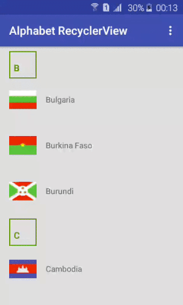

# AlphabetRecyclerView
AlphabetRecyclerView is an Android library created to be able to use RecyclerView.Adapter with a header in a easy way.

[](https://jitpack.io/#graviton57/AlphabetRecyclerView)
## Effect


## Usage

### Setup

Add in build.gradle
```groovy
  dependencies {
    	compile 'com.github.graviton57:alphabet-recyclerview:1.0.0'
}
```

### Quick Start
To use AlphabetRecyclerView in your application you have to follow this steps:
* 1 Create your custom RecylerView adapter extands `BaseAlphabeticalAdapter<E>`
``` java
 public class YourRecyclerViewAdapter extends BaseAlphabeticalAdapter<String>{
    ...
    private List<String> entityList;
    ...
```
* 2 Implement the methods in your adapter
``` java
    @Override
    public void initHeadersLetters() {
        SortedSet<Character> characters = new TreeSet<>();
        for (String s : entityList) {
            characters.add(s.charAt(0));
        }
        setHeadersLetters(characters);
    }
   @Override
    public RecyclerView.ViewHolder onCreateViewHolder(ViewGroup parent, int viewType) {
        View view = LayoutInflater.from(parent.getContext()).inflate(R.layout.your_list_item, parent, false);
        return new ItemViewHolder(view);
    }
    @Override
    public void onBindViewHolder(RecyclerView.ViewHolder holder, int position) {
        ItemViewHolder viewHolder= (ItemViewHolder) holder;
        viewHolder.textView.setText(entityList.get(position));
    }
    @Override
    public RecyclerView.ViewHolder onCreateHeaderViewHolder(ViewGroup parent) {
        View itemView = LayoutInflater.from(parent.getContext()).inflate(R.layout.list_header, parent, false);
        return new HeaderViewHolder(itemView);
    }
    @Override
    public void onBindHeaderViewHolder(RecyclerView.ViewHolder viewHolder, int position) {
        HeaderViewHolder headerViewHolder = (HeaderViewHolder) viewHolder;
        String itemTitle = String.valueOf(entityList.get(position).charAt(0));
        headerViewHolder.title.setText(itemTitle);
    }
    @Override
    public long getHeaderId(int position) {
        return position;
    }
```

* 3 Create simple view holders `ItemViewHolder` and `HeaderViewHolder` for your adaprer.

``` java
    public class ItemViewHolder extends RecyclerView.ViewHolder {
        private TextView textView;
        public ItemViewHolder(View itemView) {
            super(itemView);
            this.textView = (TextView) itemView.findViewById(R.id.id_tv_item);
        }
    }
    public static class HeaderViewHolder extends RecyclerView.ViewHolder {
        private TextView title;
        public HeaderViewHolder(View headerView) {
            super(headerView);
            this.title = (TextView) headerView.findViewById(R.id.id_tv_head_item);
        }
    }
```
* 4 Implements in your Activity/Fragment interface `OnHeaderClickListener` and `OnLetterClickListener`.

``` java
 public class YourMainActivity extends AppCompatActivity
        implements OnHeaderClickListener, OnLetterClickListener {
    ...    
     @Override
     public void onHeaderClick(View header, long headerId) {
         Character headerLetter;
         TextView headerTextView= (TextView) header.findViewById(R.id.id_tv_head_item);
         headerLetter = headerTextView.getText().charAt(0);
         AlphabeticalDialog dialog = AlphabeticalDialog.newInstance(headerLetter,
                         (TreeSet<Character>) adapter.getHeaderLetters());
         dialog.show(getSupportFragmentManager().beginTransaction(),
              AlphabeticalDialog.ALPHABETICAL_DIALOG_TAG);
     }
     @Override
     public void onLetterClick(Character letter) {
         for (int i = 0; i < entityList.size(); i++) {
             if (entityList.get(i).charAt(0)==letter){
                 recyclerView.getLayoutManager().scrollToPosition(i);
                 break;
             }
         }
     }    
  ...      
  }
```
* 5 Create adtapter and build `StickyHeadersItemDecoration`
 ``` java
 
    ...
        RecyclerView recyclerView;
        YourRecyclerViewAdapter adapter;
   ...   
  @Override
     protected void onCreate(Bundle savedInstanceState) {
         super.onCreate(savedInstanceState);
         ...
         adapter = new YourRecyclerViewAdapter(this);
         StickyHeadersItemDecoration topStickyHeadersItemDecoration = new StickyHeadersBuilder()
                .setAdapter(adapter)
                .setRecyclerView(recyclerView)
                .setOnHeaderClickListener(this)
                .build();
         recyclerView.addItemDecoration(topStickyHeadersItemDecoration);
         ...
     }
```
That is all. 

Please check out the Demo and source code for more information. If you have any question, feel free to raise an issue. Thanks a lot!

Do you want to contribute?
--------------------------

Please, do it! We'd like to improve this library with your help :)

## Thanks
- [sticky-headers-recyclerview ](https://github.com/timehop/sticky-headers-recyclerview)

## License
   Copyright 2017 Igor Havrylyuk
   
   Licensed under the Apache License, Version 2.0 (the "License");
   you may not use this file except in compliance with the License.
   You may obtain a copy of the License at
       http://www.apache.org/licenses/LICENSE-2.0
   Unless required by applicable law or agreed to in writing, software
   distributed under the License is distributed on an "AS IS" BASIS,
   WITHOUT WARRANTIES OR CONDITIONS OF ANY KIND, either express or implied.
   See the License for the specific language governing permissions and
   limitations under the License.


